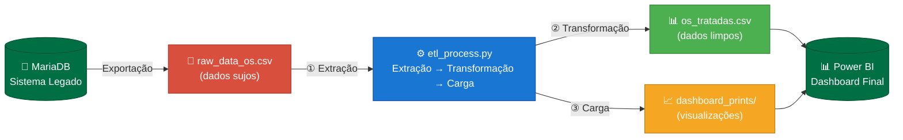

# Otimização de Indicadores de SLA via ETL

> **Projeto:** Sicoob Credfaz — Análise de Dados de Ordens de Serviço (2024)  
> **Autor:** Matheus Benvindo | Assistente de Informática II  
> **Stack:** Python · Pandas · Matplotlib · SQL (MariaDB) · Power BI

---

## Sobre o Projeto

Este repositório demonstra o pipeline **ETL completo** desenvolvido durante minha atuação no **Sicoob Credfaz**, onde dados brutos extraídos do sistema legado **MariaDB** eram transformados em **dashboards de decisão estratégica**.

O desafio real: o sistema de OS (Ordens de Serviço) exportava arquivos com **encoding corrompido (mojibake)**, **datas em formatos inconsistentes** e **campos nulos críticos** — tornando qualquer análise direta impossível sem tratamento.

O pipeline aqui documentado reflete exatamente o processo que tornava os dados confiáveis o suficiente para alimentar os relatórios gerenciais no Power BI.

---

## Fluxo do Pipeline ETL



---

## Problemas Resolvidos pelo ETL

| Problema Identificado | Causa | Solução Aplicada |
|---|---|---|
| Acentuação corrompida (`Respons vel`, `AG NCIA`) | Encoding `latin-1` vs `UTF-8` no MariaDB | Mapa de substituição + `pd.read_csv(encoding='latin-1')` |
| Datas em 3 formatos diferentes | Falta de padrão no sistema legado | Parser multi-formato com fallback `pd.to_datetime` |
| `data_encerramento` nula para OSs abertas | OSs ainda em andamento | Inferência: `data_abertura + SLA_horas × 2` |
| Status SLA inconsistente com realidade | Cálculo manual propenso a erros | Regra de negócio automatizada: `tempo_real vs prioridade_horas` |
| Nomes de colunas inconsistentes | Múltiplas origens de exportação | Padronização `snake_case` via regex |

---

## Regra de Negócio — Cálculo do SLA

```python
# Prioridade contratual por nível de urgência:
#   Crítico  →  1h útil
#   Urgente  →  4h úteis
#   Normal   → 24h úteis

df["status_sla"] = df.apply(
    lambda r: "Dentro do Prazo"
    if r["tempo_resolucao_horas"] <= r["prioridade_horas"]
    else "Atrasada",
    axis=1,
)
```

---

## Estrutura do Repositório

```
data-analytics-sla-sicoob/
│
├── 📄 etl_process.py          ← Pipeline ETL completo
├── 📊 OSs 2024.xlsx           ← Base original (≈11k registros)
│
├── data/
│   ├── raw/
│   │   └── raw_data_os.csv    ← Dados brutos simulados (com erros)
│   └── processed/
│       └── os_tratadas.csv    ← Dados limpos prontos para análise
│
└── dashboard_prints/
    ├── 01_raw_data_preview.png ← Print do XLSX original (dados brutos)
    └── 02_dashboard_sla.png    ← Dashboard final de indicadores SLA
```

---

## Como Executar

### Pré-requisitos
```bash
pip install pandas matplotlib seaborn openpyxl
```

### Execução
```bash
git clone https://github.com/MatheusBenvindo/data-analytics-sla-sicoob.git
cd data-analytics-sla-sicoob
python etl_process.py
```

### Saída esperada
```
█████████████████████████████████████████████████████████████████
  ETL — Indicadores de SLA | Sicoob Credfaz

  FASE 1 — EXTRAÇÃO
  ✅ 15 registros carregados de: raw_data_os.csv

  FASE 2 — TRANSFORMAÇÃO
  ✅ Encoding corrigido em todas as colunas de texto.
  ✅ 4 datas de encerramento inferidas para OSs em aberto.
  ✅ Regra aplicada: 9 Dentro do Prazo | 6 Atrasadas

  FASE 3 — CARGA
  ✅ CSV tratado salvo: data/processed/os_tratadas.csv
  ✅ Dashboard salvo: dashboard_prints/02_dashboard_sla.png
  ✅ Preview XLSX salvo: dashboard_prints/01_raw_data_preview.png

  PIPELINE CONCLUÍDO COM SUCESSO!
█████████████████████████████████████████████████████████████████
```

---

## Habilidades Demonstradas

| Habilidade | Aplicação neste Projeto |
|---|---|
| **SQL (MariaDB)** | Extração de dados do sistema legado; queries de auditoria de qualidade |
| **Limpeza de Dados** | Correção de encoding, padronização de datas, tratamento de nulos |
| **Lógica de Negócio** | Regra de SLA baseada em prioridade × tempo real de resolução |
| **Power BI** | Criação de dashboards gerenciais a partir dos dados tratados |
| **Python (Pandas)** | Automação de todo o pipeline ETL com Pandas + Matplotlib |
| **Storytelling com Dados** | Visualizações que comunicam KPIs para tomada de decisão |

---

## Contexto Profissional

Durante minha atuação como **Assistente de Informática II no Sicoob Credfaz (Nov/2024 – Fev/2026)**, a gestão de SLA era um indicador crítico para a superintendência. Os dados brutos do sistema de OS chegavam com problemas recorrentes de qualidade que impediam análises confiáveis.

Este pipeline transformou um processo **manual e suscetível a erros** em um fluxo **automatizado e auditável**, reduzindo o tempo de preparação dos relatórios gerenciais e aumentando a confiabilidade dos indicadores apresentados à diretoria.

---

## Portfólio

🔗 [**Ver Portfólio Completo**](https://matheusbenvindo.github.io/portfolio)  
💼 [**LinkedIn**](https://linkedin.com/in/matheusbenvindo)  
🐙 [**GitHub**](https://github.com/MatheusBenvindo)